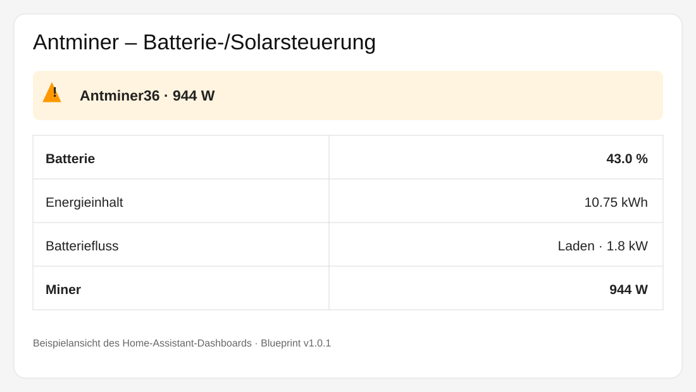

# Home-Assistant

Sammlung von Home-Assistant-Blueprints und Automationen für Energie-, Batterie-, Solar- und Miner-Steuerung.

## Antminer – Batterie-/Solarsteuerung 2832/1500/944 W

**Version: v1.0.1**

Blueprint:
`blueprints/automation/antminer/antminer_batterie_solar.yaml`

Dieser Blueprint steuert einen Miner abhängig vom Ladezustand der Batterie (SOC) und – bei niedrigem SOC – zusätzlich abhängig von der aktuellen Batterieladeleistung.

### Visualisierung

Beispielansicht der Statusanzeige in Home Assistant:




### Funktionsübersicht

Die normale SOC-Kennlinie lautet:

| Batterie-SOC | Miner-Leistungsziel |
|---:|---:|
| **≥ 60 %** | **2832 W** |
| **40 % bis < 60 %** | **1500 W** |
| **25 % bis < 40 %** | **944 W** |
| **24 % bis < 25 %** | **aktuellen Zustand beibehalten** |

Unter **24 % SOC** greift ein Solar-/Ladeleistungs-Override. Dabei wird die tatsächliche Batterieladeleistung ausgewertet:

| Batterie-SOC | Batterieladeleistung | Miner |
|---:|---:|---:|
| **< 24 %** | **> 4000 W** | **2832 W** |
| **< 24 %** | **> 2500 W bis 4000 W** | **1500 W** |
| **< 24 %** | **> 1500 W bis 2500 W** | **944 W** |
| **< 24 %** | **≤ 1500 W** | **STOP** |

Alle Schaltschwellen müssen **5 Minuten stabil** anliegen.

### Verhalten bei 24–25 %

Der Bereich **24,0 % bis unter 25 %** ist bewusst ohne Aktion. Der bisherige Miner-Zustand bleibt erhalten.

Ab **25,0 %** wird wieder die normale SOC-Kennlinie angewendet und der Miner auf **944 W** gesetzt.

### Neustart von Home Assistant

Nach einem Neustart von Home Assistant wartet der Blueprint zunächst **30 Sekunden**, damit die gewählten Sensorwerte verfügbar sind.

Anschließend wird der aktuelle Batterie- und Ladezustand ausgewertet und der Miner entsprechend gesetzt.

Beispiel:

`55 % SOC → 1500 W`

### Eingaben des Blueprints

Beim Erstellen einer Automation aus dem Blueprint werden die gerätespezifischen Entitäten ausgewählt:

| Eingabe | Funktion |
|---|---|
| **Batterie SOC** | Sensor für den Batterie-Ladezustand in Prozent |
| **Batterie-Leistung** | Sensor für die Batterieleistung in Watt |
| **Vorzeichen bei Batterieladung** | Positiv oder negativ, je nach Systemdarstellung |
| **Miner Leistungsziel** | Steuerbare `number.`-Entität des Miners |
| **Miner Start** | `button.`-Entität zum Starten des Miners |
| **Miner Stop** | `button.`-Entität zum Stoppen des Miners |
| **Gesamte Batteriekapazität** | Kapazität in kWh für die Energieanzeige |
| **Benachrichtigungs-ID** | Eindeutige ID für die persistente Statusmeldung |

### Vorzeichen der Batterieleistung

Der Blueprint kann zwei Darstellungen verarbeiten:

- **positiv = Laden**
- **negativ = Laden**

Damit kann derselbe Blueprint mit unterschiedlichen Wechselrichter-/BMS-Integrationen verwendet werden.

### Benachrichtigungen

Bei einer tatsächlichen Änderung der Miner-Leistung erzeugt der Blueprint eine persistente Home-Assistant-Benachrichtigung.

Die Meldung enthält unter anderem:

- aktuellen Batterie-SOC
- rechnerischen Energieinhalt in kWh
- Batterieleistung
- erkannte Lade-/Entladerichtung
- aktuelle Ladeleistung
- neue Miner-Leistung

Für unterschiedliche Miner sollte eine eigene **Benachrichtigungs-ID** verwendet werden.

### Beispielkonfiguration für das hier getestete System

Beim getesteten System werden folgende Entitäten verwendet:

`sensor.growatt_battery_battery_soc`

`sensor.growatt_battery_battery_power`

`number.antminer36_power_target`

`button.solargarten_antminer36_bosminer_start`

`button.solargarten_antminer36_bosminer_stop`

Gesamtkapazität:

`25 kWh`

Bei diesem System gilt derzeit:

- positiver Wert der Batterieleistung = Laden
- negativer Wert = Entladen

### Installation in Home Assistant

Der Blueprint kann aus dem GitHub-Repository importiert werden.

**Import-URL:**

https://raw.githubusercontent.com/Nebukadneczar/Home-Assistant/main/blueprints/automation/antminer/antminer_batterie_solar.yaml

In Home Assistant:

**Einstellungen → Automationen & Szenen → Blueprints → Blueprint importieren**

Dort die Import-URL einfügen und anschließend die gewünschte Automation aus dem Blueprint erstellen.

### Wichtiger Hinweis

Der Blueprint arbeitet mit den tatsächlich ausgewählten Entitäten des jeweiligen Home-Assistant-Systems. Entitätsnamen, Leistungsgrenzen, SOC-Werte und Start-/Stop-Funktionen können sich je nach Miner, Wechselrichter, Batterie und Integration unterscheiden.

Die **farbige Dashboard-Karte** ist nicht Bestandteil dieses Blueprints. Sie ist eine separate Home-Assistant-Dashboard-Konfiguration.

## Repository-Struktur

```text
Home-Assistant/
├── README.md
└── blueprints/
    └── automation/
        └── antminer/
            └── antminer_batterie_solar.yaml
```

